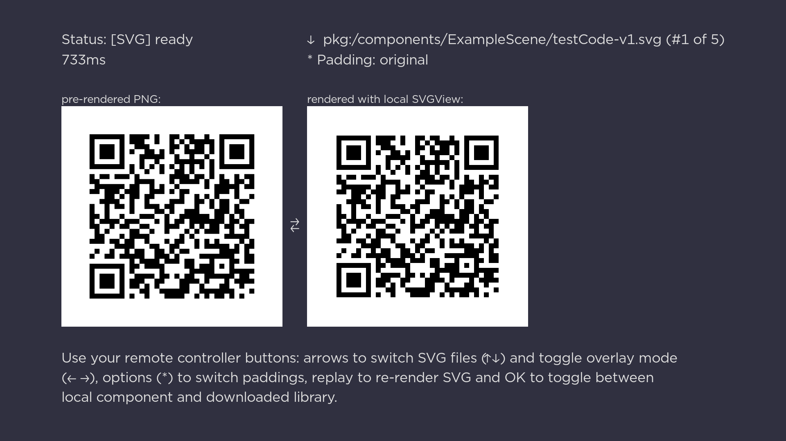

Simple SVG View
===============

A VERY naive, simple parser and renderer specializing in SVG files with QRCode encoded in Path element.


## Usage

Either import whole [SimpleSVGView](components/SimpleSVGView) directory to your project, or import it
dynamically using [ComponentLibrary](https://developer.roku.com/en-gb/docs/references/scenegraph/control-nodes/componentlibrary.md).

```xml
<SimpleSVGView
	id="renderedCode"
	width="500"
	height="500"
	padding="-1"
	blendColor="#FFFFFF" />
```

After `SimpleSVGView` is set on SceneGraph, set its `svgData` field to the content of SVG file.
It will run [`SimpleSVGTask`](components/SimpleSVGView/SimpleSVGTask) to parse and render SVG as PNG.
You can observe `status` field for `failed` or `ready` state, same as with well-known `Poster` node.

```brs
renderedCode.observeFieldScoped("status", "onRenderedStatusChange")
renderedCode.svgData = downloadedSVGContent
```

Check [Example](example) to see how it all can be handled.


## Running example

By default `make` command will use `dev` environment, so be sure to have a `dev.env` file configured.
See [dev.env.sample](dev.env.sample) - you can remove the `.sample` from the name and fill in your info there.

Once environment is configured, simply run:

```sh
make test
```

It should package example, sideload it to Roku device and launch app that shows QRCodes on screen:




## TODO

- It would be nice to parse data from QRCode. We already have "bits", we just have to decode them;
- It could be useful to support also SVGs that use `Rectangle` nodes instead of a single `Path`;
- Someday it could support more of SVG and handle generic images, as long as they don't use any curves
  (so not many of them).
  Roku's [Draw2D](https://developer.roku.com/en-gb/docs/references/brightscript/interfaces/ifdraw2d.md)
  does not support curves, and implementing custom drawing is out of scope. It's not impossible but
  would require A LOT of work and result would run too slow to be of any use.


## Thanks

While working on this component, these were of great help:

- [QRCode generator](https://github.com/kazuhikoarase/qrcode-generator) i used for
  quickly creating example files (it's easy to edit JS version to output different formats of SVG);
- [SVG Path syntax guide](https://css-tricks.com/svg-path-syntax-illustrated-guide/)
  that explained basics of SVG Path quite well;
- [SVG specification](https://www.w3.org/TR/SVG11/paths.html#PathData) that clarified
  everything else;
- [Inkscape](https://inkscape.org/) helped pre-rendering SVG to PNG examples;
- [Sublime Text and Sublime Merge](https://www.sublimehq.com/) used to write and commit project.