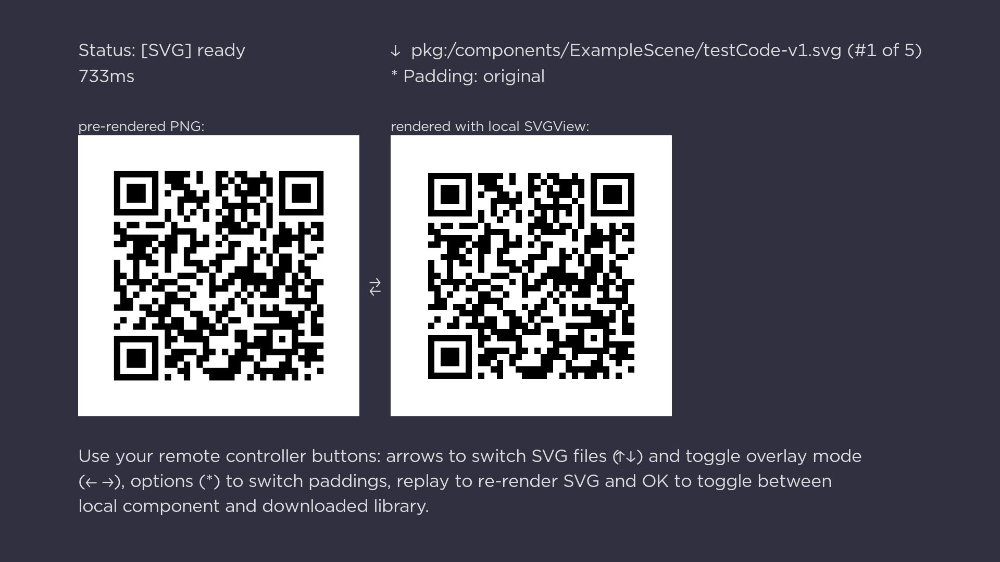

Simple SVG View Example
=======================

This is just an example and a simple test to see how SVG are rendered and compare them
to the pre-rendered PNGs.

- Use **left**/**right** arrow buttons to overlay rendered version onto pre-rendered one.
- Use **options** ("star") button to change padding on the rendered version.
- Use **up**/**down** arrow buttons to switch SVG file (they all show the same data,
  formatted in different way inside SVG file).
- Use **replay** (⟲ - "circled arrow") button to force re-rendering SVG, instead of just
  loading from cache what was already rendered before.
- Use **OK** button to switch between local component and one loaded dynamically from
  GitHub repository.

